# Project report - HealthMonitor

## Abstract

Statistics shows that over 26% of adults between 50 and 80 don't measure their blood pressure as often as they should. Hypertension, also known as blood pressure, increases the risk of heart disease and stroke, two leading causes of death in USA and Europe. As a result, we have developed a IoT device to make blood pressure tracking easier for exposed adults and elders. Healthmontor tracks blood pressure through a device such as a smart watch, and sends it to the patients doctor for reviewal.This may help people slacking on their tracking, and provide better quality of life. 

## Introduction

In one of our courses here at NTNU Ålesund, we have been assigned a group project to create an application for the Internet of Things (IoT). The intention of the project is to apply the knowledge on networking in a broader context, by actively using our former knowledge on system development to create an application with social meaningful benefits. Considering this, the group has decided to create an application for doctors to monitor its patients. The application will mainly target adults and elders, but also people suffering from other diagnoses to help in case of emergencies.

Statistics from 2021 shows that more than half of adults between 50 and 80 have health conditions that put them on high risk if they don't keep their blood pressure under control. In all, 26% of all these adults in the range of 50 to 80 years of age, said they dont monitor their blood pressure as often as they should[1].

We want to make an application which makes it easier for all patients to monitor their blood pressure. By using devices such as smart watches, we could sense minutely, or hourly, the patients's blood pressure in constant time, and send the information to the doctor for monitoring. Our application will also have the social benefit to warn doctors about patients whose blood pressure is too high, or too low, depening on the situation the patient is located in. This can therefore also be used as an alternative for a elderly home or other sorts of medical institutions for elderly persons and persons with cardiovascular diseases, when a patient can be considered stable enough for this sort of solution rather than being moved to a institution for monitoring. 

## Theory and technology

As of web development, we use HTML5 and CSS for webdesign and decoration. HTML is a hypertext markup language for the web that defines the structure of web pages by creating html elements. Web pages are mostly structured by divisions, also called divs. These are containers that contain other html elements such as paragraphs, tables, text and buttons. In our webdesign, we have actively been using divisons to distribute responsibility of elements to make both html and css code more structured.

CSS, cascading style sheets, is a programming language used to describe html elements with properties such as coloring,

In terms of the data generation we chose to rely on syntetic data to simulate the health of the patients. As the measurement of blood pressure is highly complex and requires both technological and medical expertise to gather and interpret the data. With the timeframe of this project this would not be attainable. However, the data is based of actual medical records to ensure that the application is tested in a realistic enviroment[2]. Given that blood pressure oscillate it makes the modelling of the data more complex than it would be modelling stable data. In order to achieve realistic datasets we have incorporated the use of trigonometric functions as they have the ability to describe entities that fluctuate.

#### Computer network technology

For the different parts of the application to be able to communicate with each other, we had to utilize a
different set of network technologies and protocols.

The website is hosted on a UNIX server running Apache 2.4. Both the hosting services of both the webpage and the database is delivered by Loopia. They have also provided an SSL-certificate from Let’s Encrypt. These services was purchased by a group member before planning this project, and the group decided to use these services when developing our project, making it closer to a real world implementation, making it easier to implement security measures, and to be able to use a hosted webpage as our visualization node and GUI as well for external storage of data in the database.

The entire webpage is configured with forced HTTPS, making all access to the website encrypted as well as internal HTTP requests. For the website to be able to display data from the database, we have used JavaScript with AJAX to perform HTTP requests to server-files which has been written in PHP. The PHP files are able to access and query data from the database, and it can return it to the webpage using JSON encoding for the data, which are attached to the HTTP responses. When using Wireshark to perform packet sniffing, we discovered that all HTTP requests uses HTTPS and not HTTP. This is due to the SSL-certificate.

Both the website and the java-server is able to connect to the server which is hosting our database. For this, we have implemented MySQL drivers in both php and in java, making it possible for both
applications to connect to the database. The protocols being used for this is MySQL implemented in the Application Layer. This is transmitted with TCP from the Transport Layer. MySQL supports transparent encryption using SSL. This should result in that the connection between the website and the database is encrypted since our SSL-certificate should automatically apply it to all incoming and outgoing
transmissions. There is however no guarantee that this is the case for the java-server when it connects to the database. 

The connection between the Sensor and the Bridge, and the Bridge and the Sensor is using TCP. We have implemented this using socket-programming in both Java and Python. We chose to use TCP rather
than UDP due to the nature of the data being transmitted. It is unacceptable for data to be lost when it is of such importance regarding the health of the patients, and TCP ensures reliable data transfer in a degree which standard UDP transmission cannot compare. One can however discuss whether the Sensor and the
Bridge could use UDP instead of TCP since they will be located on the same network, this would however require for the group to add RDT techniques in the Application Layer for this modifyed UDP to be considered as reliable enough for us to use in our scenario. Due to the timeframe we had, we decided to use TCP instead.

We figured that even when using TCP, there still was some problems with the data transmission. The flow control was not sufficient since a receiver used more time processing data than what the sender needed to send more. The solution for this was to apply multithreading to both the Bridge and the java-server. One thread will be listening to a port, waiting for incoming data. When data arrives, a new thread will be created which is responsible for further processing of this data. Each thread (except the thread which is listening for incoming data) is arranged in such a way that they will not be executed before the previous one is. This proved necessary when dealing with the Coordinator in the java-server, since the processes running
in parallel tended to interfere with the other process when connecting to the database through the DatabaseClient. This is most likely due to the DatabaseClient-class being static, making all threads interact with it simultaneously. When using multithreading, we discovered better flow in the transmission. Data was received and processed faster, and there were less problems with e.g., the buffer of receivers being filled
up.

The computers running the different software can identify each other using the IP protocol. We are using IPv4. When several parts of the software is running on the same computer, we assign a port number for each service.

For the server to recognize what is considered as acceptable health values for patients of different ages and genders, the server includes a JSON file which contains these values. When receiving a new measurement, the server will identify both age and gender of the patient through database queries, then it will use a JSON handler to access the internal JSON file and retrieve the relevant values. JSON is a text-based standard for formatting documents. It is commonly used for storing data such as we have done, as well as for having a standardized structure for transmitting data between e.g. a database and webpage. The PHP server-files in our web application uses this to ensure that there is a common agreement between JavaScript files and PHP files regarding the format of exhanged data.

#### Methodology
The group has arranged meetings on a regular basis throughout the lifespan of this project. These meetings has mainly taken place at the school, but when this was not possible, we have done virtual meetings instead. A typical meeting usually lasted an hour or two based on the agenda. At the start of this project, the meetings where often shorter, and we had typically one meeting per week. As we advanced in our development, the meeting frequency rose to two meetings per week, where they often where longer as well.

The meeting agendas usually consisted of each member informing the others how their work has been, whether they have experienced issues or have other ideas. Later, we usually got ourselves an overview over what work which were to be done next, setting deadlines, passing new ideas and planning. Sometimes, we also has been sitting together while working on our jurisdiction of the code individually. Mostly however, the group has worked separatly and in a self-paced tempo, where each member has a deadline for the completion of their specific task. 

We have mainly used Discord for communication, but we have actively used the issue board in GitHub for listing the work which each group member were expected to complete in a certain time frame. The work which has been done has not only been code-oriented. During the middle-part of our project, much of the work which needed to be done where things such as database-design and researching.

## Results

#### System architecture

***`System architecture`***

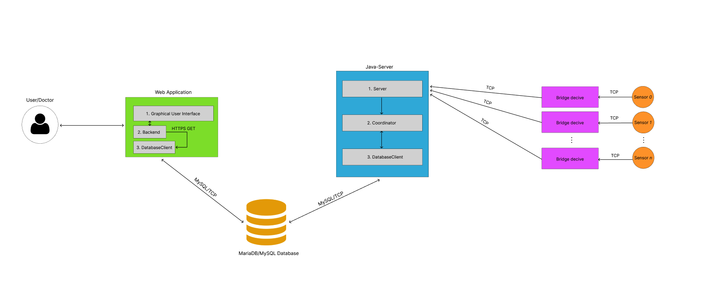

The software which HealthMonitor consists of can be divided into these components:

- Sensor:Attached to a patient and performs measurements.
- Bridge/Analyzer: Located at the patients home. Receives and formats measurements.
- Server: Receives the measurements from the Bridge. Processes it and uploads to database.
- Database: Contains patient information, measurements, and user-information.
- Website: Visualization node, fetching data from the database.

A patient will have a sensor attached to itself, most likely a wristband. This wristband will
measure blood pressure and heartrate every X seconds. This date of the
measurement, the measurement, and the serial-number of the sensor will be concatenated
into a string, which will be sent using TCP to the Bridge.

The Bridge will receive the data as they arrive. It runs one thread for listening, and other
threads for processing each packet received. The processing consists of transmitting
the string to the java-server using the same format, and through TCP.

***`Sensor to Bridge to Server`***

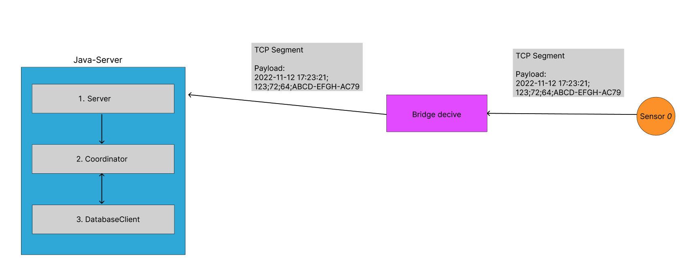

When the server receives the data, it will create a thread which are to handle this measurement. The received string will be sent to the Coordinator-class. Here, the Coordinator will identify the patient by using the getPid() method of the DatabaseClient-class using the serial number of the sensor as parameter. Further on, the Coordinator will require the N last measurements for this patient. If the patients last measurements differs by the expected values, the patients health status will be set to. “UNUSUAL”. If the average of the last N measurements differs by the expected values, the status will be set to “CRITICAL”. The connection to the server which is hosting the database goes through the Application Layer protocol MySQL which carry queries and results. This protocol is wrapped in TCP.

***`Server to Database`***

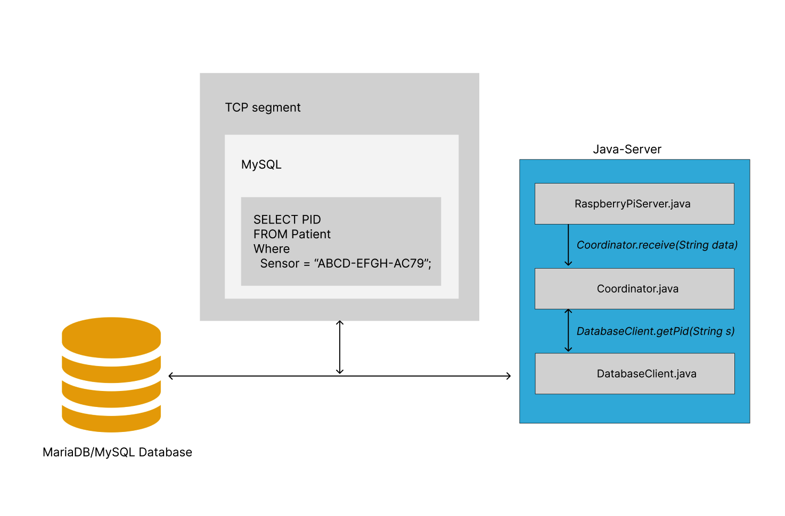

When logging into the website. A doctor can either search for a specific patient by either name or id, or the doctor can see all patients whose status is not “STABLE”. The patient can see the journal of each patient. The journal contains all information regarding the patient including diagnoses. A graph will also be displayed to show the development of measurement-values for blood pressure and heartrate.

The content-containers are located in the HTML and decorated with CSS. The JavaScript files will add functionality to the webpage as well as plotting the graphs using Chart.js. They will also send HTML requests using the GET method to the PHP server-files. The server-files contain queries which will be completed by parameters specified in the GET request. This query is then sent to the database-server using the MySQL protocol and TCP. The result will be JSON encoded and returned as an HTTP response to the JavaScript-file which sent the request. Then the content will be displayed in the HTML-files using DOM. This makes the result visible for the user.

***`Webpage to Database`***

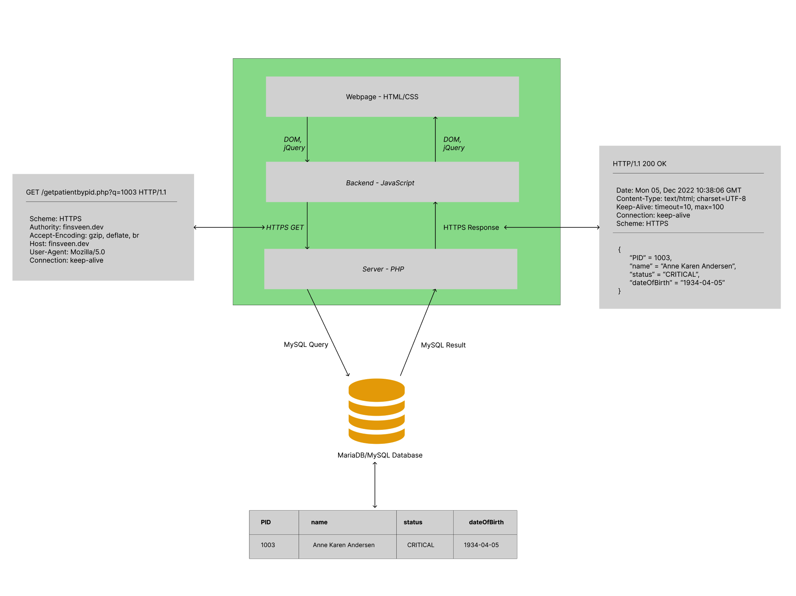

#### Final product

We are satisfyed with the overall functionality of our application. We have tested it several times as well as performing user-tests with volunteers. As far as we can see, the application does not crash or contain critical bugs. All data being generated is received and displayed in the webpage. The webpage is working according to our intentions, the effeciency is good, and the system is quite secure as well.

Here are some provided screenshots showing that the system works in its different sub-applications.

*Journal for Silje Mortensen*

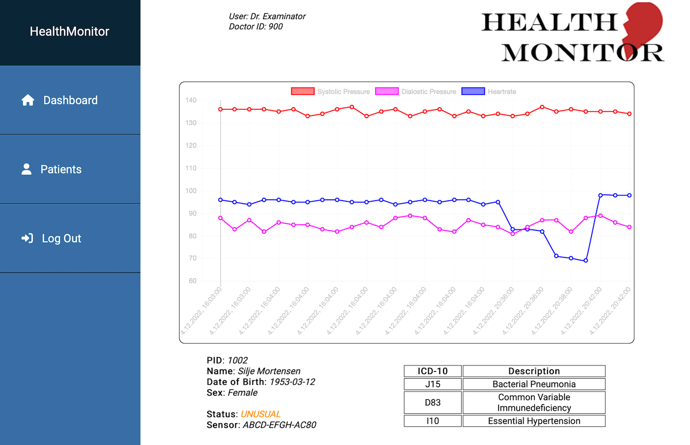

*Graph where Heartrate is hidden by using the button*

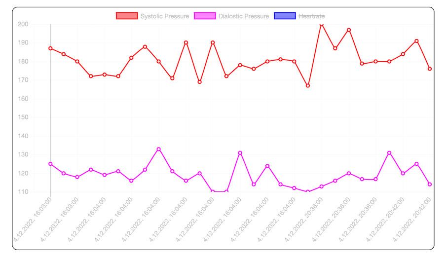

*Searching for a patient whose name contains "hans"*

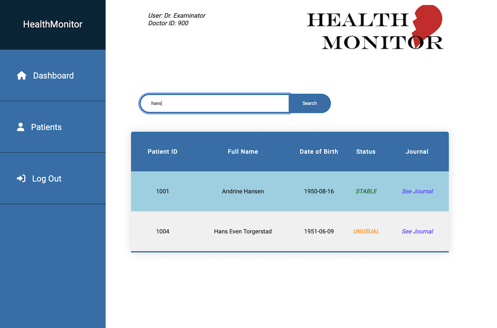

*All patients with CRITICAL or UNUSUAL status being listed on the dashboard as "pending patients"*

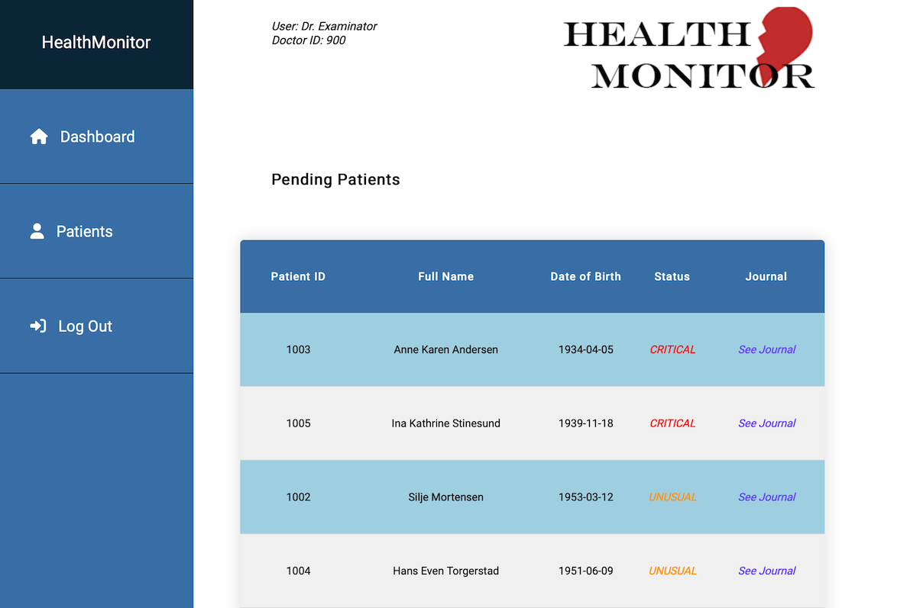

*All internal transmission in the webpage uses HTTPS when using packet sniffing in inspect element*

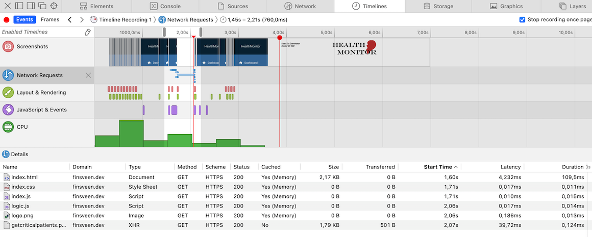

*Bridge receives measurements generated for sensor "ABCD-EFGH-AC83" and "ABCD-EFGH-AC84" where the last sensor is measuring Hallstein Andersen for the first time,*

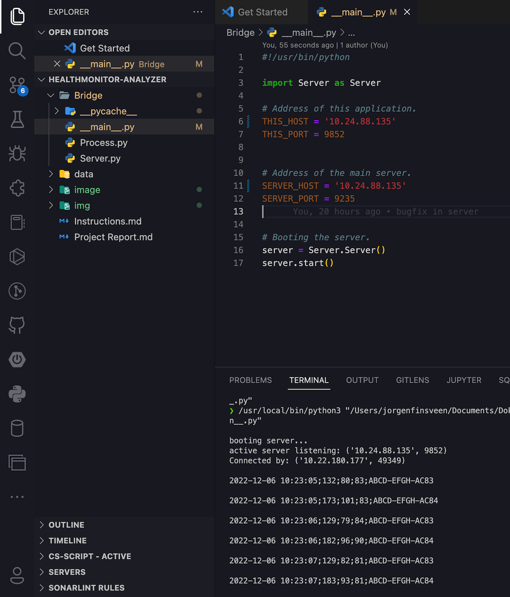

*Java-Server as an executable .jar-file receives the measurements from the Bridge*

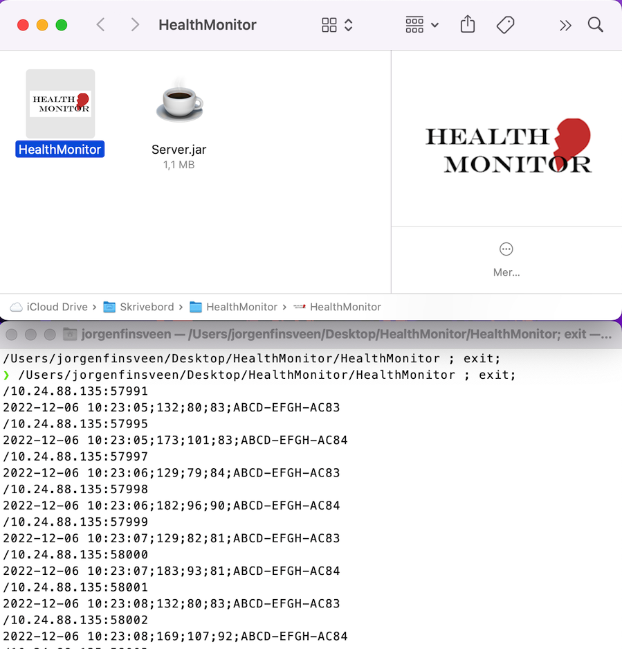

*In Hallstein Andersen's journal, the new measurements has arrived*

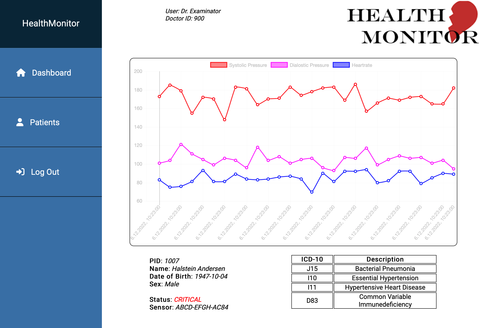

*The database stores the information which is being sent to it. First picture is the Patient entity-type. The second is the PatientData relation which contains all measurements receivied, referencing Patient using Patient.PID as foreign key, and PID and Time as primary key.*

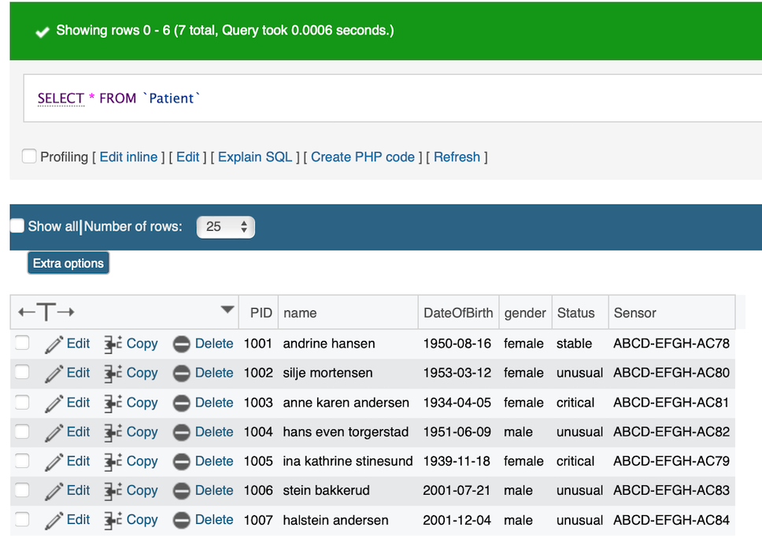

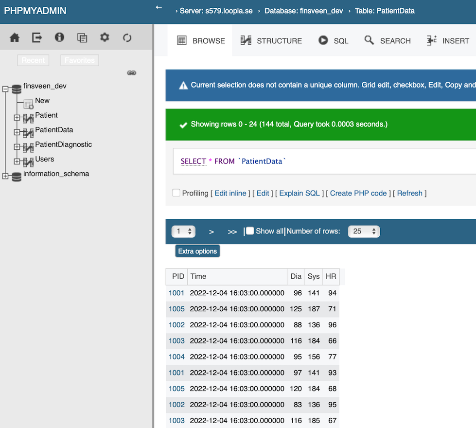

#### Security

**Web-domain specification**

* Sub-domain: .dev
* Configuration: UNIX (PHP 8.1/Apache 2.4)**
* SSL-Certificate: Let’s Encrypt
* Protocol: HTTPS-only

***Database-server specification***

* DBMS: MySQL/MariaDB
* Server: mysql579.loopia.se
* Name: finsveen_dev
* Users:

  * admin@f328341
    * Permissions: All
    * Password: 17 letters, numbers, and special characters
    * Host: phpMyAdmin
  * web@f328341
    * Permissions: Read-only
    * Password: 17 letters, numbers, and special characters
    * Host: %
  * backend@f328341
    * Permissions: Read, Write, Delete
    * Password: 17 letters, numbers, and special characters
    * Host: %

**Web-application architecture**

* XMLHttpRequest API: HTTPS-protocol only due to the SSL-certificate
* MySQL-Client: mysqli_connect using pipes when possible, else TCP/IP

**Login-Solution**

* Self-made where login-credentials are stored in the database
* Optional solution issued by the domain-host

Due to the nature of the data which are to be visualized and handled in this
application, security has been of a great concern. The group has therefore
established resources intended to increase the level of security throughout the
application.

The web-application has been given an SSL-Certificate, allowing the website to only
use HTTPS rather than HTTP. We have configured the website in a way that forces
HTTPS, so that the less secure and non-encrypted protocol HTTP does not apply.
This does also affect the way the website communicates with the database
through the php-server, since the XMLHttpRequest API implemented in the JavaScript/Ajax
components of the website also will be forced to use HTTPS as well.

The php-server connects to the database through the relational database-driver
MySQLi through TCP/IP. Since the website forces the usage of HTTPS, this
connection will also use this protocol. The login-credentials used to connect
to the database-server is stored in a separate folder, and it is not directly
accessed by the php-code, making it harder for users to find this information
through using the “Inspect Element” function in a web-browser. The folder
containing the login-information is also secured with a password protection
solution issued by the web-hosting service hosting the website. This makes this
information even more secure.

The database-server can be accessed by a couple of users. The users are meant for
different operations, and they have been given their privileges, accordingly,
making them less resourceful in the wrong hands. Each user are
password-protected with passwords consisting of 17 symbols including letters,
numbers, and special characters, making the passwords nearly impossible to
crack using brute-force in a reasonable time.

One weakness that should be improved in the future is how the login-page works when
logging in to the website. This is a mechanism the group has made, where post
username and password is sent to a php-server using HTTP Get method. Usually,
one does not use GET for passing private information like login credentials,
but since we use HTTPS instead, it can be forgiven since the entire data
transmission will be encrypted, making it hard for Man in the Middle attacks. One
idea on how to improve this is to use the POST method instead. We have
nevertheless performed packet sniffing with Wireshark to verify the quality of
our current solution. We were not able to find the login-information through
packet sniffing, which is a good sign. Furthermore, the password and username
should be hashed in the database. As of now, the passwords are stored in plain
text in the database.

The java-server has a direct connection to the database. We consider this part of the application to be quite safe since this server would be located on a secure location where few people have access
to it. Furthermore, fake measurements cannot be sent to the server without
having the correct serial number of a sensor. A possible improvement in the
future is to implement a way for the server to recognize the computer which
sends measurements through its IP address and port number. This however assumes
that the IP address is static.

The servers connection to the database is through a user with most permissions granted to it. The login information is therefore valuable to possible hackers. A future improvement of the server security could
also be to enable two-factor authentication for the user which the server connects to the database server with. This could be hardware-based like an encrypted YubiKey.

The security measures regarding the sensors
and the bridge which transmits the data to the server could be more secure. Its
security partly depends on the security measures applied to the home network of
where these components are located on. Home security measures such as firewalls
should be encouraged. Furthermore, the TCP connection between the components
should utilize SSL/TLS encryption, making the data hidden for potential hackers.
Such security can be applied using an SSL certificate, and it would also allow
for the server to verify the authenticity of received data.

#### Web

At first we were unsure on whether to use text-based terminal gui, or create a webpage for visualization. However, we landed on creating a webpage due to its simplicity and ease of use. Some of the functionality we discussed before creating the website was:

* Patients visualization through table
* Patient search
* Diagrams for bloodpressure
* Choose patient and see data
  and structuring by using HTML elements. HTML elements are the building blocks of a webpage, and are created by using tags and attributes.

Some of our goals when designing the website are good interaction between user and machine, such

Currently we have limited the scope of the webpage to only show critial patients at the dashboard, as well as all patients under the patients tab in the sidebar. By using sidebars, we can easily expand the scope and implement new functionality by writing more HTML and CSS code.

#### Database

For the database we have chosen a relational data model to store our patients and users data. As there are only 2 relationships and 2 entity sets to model we chose the relational model for familiarity. The model is structured in a way that patients can have multiple diagnoses and multiple data entries. To ensure the integrity of the database there is applied a primary key to all relations and entity sets, this ensures that a patient can only have a realtion to a diagnosis once and no duplicate data entries for that patient at one time. This makes sure that there are no redundancies in the database and protects the data from anomalies.

#### Data generation

In this case, a sine wave which grows psudo-randomly but are constructed in a way that it will only diverge from the average value when in range of realistic values for blood pressure. This way the data fluctuates as a blood pressure normally would and allows for a realistic model.

For improvements the generation methods could be optimized and refactored to a single module with the goal of generating, and a complementing module who focuses on generating patients. As it is now both generation of patients and data is done in the same module. But ultimatley the biggest improvment when it comes to the dataset of the application would be implementing actual sensors with actual real data from patients.

#### Wireframes

<!-- Extension -->

#### User testing

We wanted to get feedback on how we could improve our application. The focus was
primarily on the website. Therefore, we arranged an event where people could receive
login-information and enter the website and explore it. The website was at this
point quite extensive, but the data which the testers would receive from the
database was test data.

The testing took place between 17.11.2022 and 18.11.2022. There were a total of 8
participants which tested the application. The participant where of various age
ranging from 20 to 50, and their knowledge of medicine, user interaction and computer
networking where different for each participant as well. The feedback we
received can be summarized to the following issues:

* *All patients should be listed on the search-page by default.*
* *When searching for a patient, the list of patients should adjust to
  what the user is typing.*
* *When pressing enter, the search button should activate.*
* *The colors of the graph in the Journal-page should be adjusted so it
  is easier to distinguish the different graphs and text.*
* *One should be able to log out of the application as well.*

Upon ending the testing event, we went back to the website and applied all the changes
mentioned above. After, we let participants test again to make sure they were
content with the changes which we had done.

## Discussion

#### Future development

HealthMonitor has proven to be a working solution, and our group is content with its
capabilities considering our abilities and the timeframe we had. However, there
are several developments which would boost this application.

A fully implemented version of HealthMonitor would need real nodes rather than
the synthetic ones which are being used now. We would need to adjust the Bridge
for these two to be compatible.

We would also like the java-server to be hosted on the Internet. This would make
it more accessible, as well as it would allow us to increase the security
around it, using two-factor authentication for database-connection, self-configured
firewalls etc. A problem which we encountered during this project was that we
had difficulties sending TCP data to devices which were not on the same
network. We figured this to be because of firewalls surrounding the networks.
If the server could be hosted on the Internet, we are fairly confident that we
could resolve this issue. The server would likely receive much data from sensors
measuring different patients, so this server would need to be able to handle such
traffic. This sets some requirements to both the network capabilities of which
the server is connected to, as well as the computer which is running the
software.

Even though we are quite satisfied with the security measures applied to
HealthMonitor, we would most likely add new features to improve this aspect as
well. This would be things like adding TLS/SSL encryption on top of TCP
transmissions, better login-system on the website and server as well as better solutions
for storing login-credentials in the database, using encryption. An other improvement could be to have the server and the bridge store the IP address and the port number of the verifyed clients. This would require for the clients to have either static address and port, or for the server to autimatically detect the changes and to be able to re-verify the autenticity of the client. In the java-server, a possible solution could be to combine the IP address and port number of each verifyed client, hash the combination and use it as a key in a HashMap. We have however used the sensor serial number as an identificator instead.

We would also like to add more functionality to the website. We would like for a
user to add or remove patients from its watchlist as well as being able to interact
with its patients when necessary. The last feature could be e.g., that the user
could send an alert through the website, so that the patient would get an SMS. Another
idea would be to allow a user to get alerts when a patient’s status is updated.
An admin-user should also be able to register new users.

#### Exceptional features

##### Generator

The generator is exceptional as it encorporates periodic funcitons learned in math in order to simulate data which resembeles blood pressure. The simple way of generating the data would be to have a random values inbetween a realistic range. As the varaibles diastolic and systolic blood pressure are dependent variables fluctuation in one variable could affect the other. This is easier and more flexible when using periodic functions as math can be used for changes.

The creation of this generator requires knowledge of statistical methods, as well as medical knowledge. The generator is also capable of sorting arrays of data, and it is using recursive methods, which makes competence regarding algorithms and datastructures relevant for this project.

##### Architecture

We consider our architecture to be exceptional. The fundamental requirements require for us to program at least one sensing node and one visualization node. We have created generator for sensing node data. Our system is scalable, and for us to actually connect to several sensors would only require for us to adjust the Bridge application. We have a quite advanced visualization node as dynamic website.

The groups opinion is that the architecture is excellent. It is quite close to how a real world implementation of this as an IoT solution. It is effective and logical.

We have implemented a database for this application, which has required a fairly amount of knowledge regarding database design, SQL, etc. It compliments our application, making it even more convenient as well as increasing the overall quality of our solution.

There is also lots of security measures implemented throughout the application architecture, making it more durable and resistant to illegal data manipulation, deletion and surveillance. 

##### Multithreading

We decided to multithread the parts of the application which contain server functionality. This is the Bridge, and the Java-Server. We have utilized this technology to increase the performance of our system, improving the transmission rate since data is processed in paralell to receiving new packets. This could be considered an improvement of the flow control of data transmission, and it allows our servers to handle several data transmission coming from several devices simoltaneously.

#### Dyanamic webpage

Due to the exceptional criterias set for this project, we have decided to create a dynamic webpage for patient representation. Visualization of generated data are shown in graphs programmed in Javascript. The graphs contain accurate values based on scientific papers to make it as realistic as possible. Doctors have the possibility to read journals of every patient and see their historic values.

#### Security

As mentioned in this report, our application provides several security measures of high quality which would be considered crucial HealthMonitor to be used in the real world. The security has been a top priority for the group, and we consider the implementation of those to further increase the exceptionality of our project.

## References

[1] https://labblog.uofmhealth.org/rounds/many-at-risk-older-adults-arent-checking-blood-pressure-at-home-or-being-encouraged-to-do-so?fbclid=IwAR1x0WsrFR9vXrwJmKyf8ys5_aMfzVVqm3BcdKE6KTIKHlJt2L3r7m-GgYk

[2] National Health and Nutrition Examination Survey 2007-2010. JAMA. 2011;305(19):1971-1979

#### Hosting services

This group has utilized services from Loopia for this application. The services include:

- Website hosting
- SSL certificate
- Database server and databases
- FTP server

The services was not bought for this project specifically. One of the group members had already bought these services before this project was started. See more on https://www.loopia.no/webhotell/ (Webhotell Gull)
